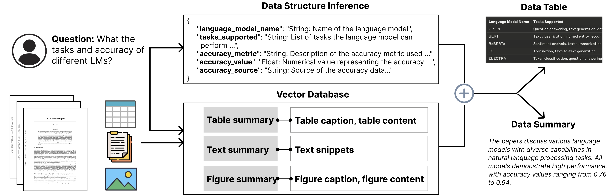

# SciDaEx: Scientific Data Extraction and Structuring System



SciDaEx is a open-source system for extracting and structuring data (as data tables) from scientific literature using Large Language Models (LLMs). It integrates a computational backend with an interactive user interface to facilitate efficient data extraction, structuring, and refinement for evidence synthesis in scientific research.

## Table of Contents

- [SciDaEx: Scientific Data Extraction and Structuring System](#scidaex-scientific-data-extraction-and-structuring-system)
  - [Table of Contents](#table-of-contents)
  - [Features](#features)
  - [Installation](#installation)
    - [Configuration](#configuration)
  - [Usage](#usage)
    - [Preprocess documents](#preprocess-documents)
    - [Running the web application](#running-the-web-application)
  - [Contributors](#contributors)
  - [Contact](#contact)

## Features

- Automated data extraction from scientific papers (text, tables, and figures)
- Structured data table output in standardized formats
- Interactive user interface for data validation and refinement
- Retrieval-augmented generation (RAG) for enhanced accuracy and speed
- Quality evaluation metrics for extracted data
- Support for both technical and non-technical users


## Installation

```bash
# Clone the repository
git clone https://github.com/xingbow/SciDaEx.git
cd SciDaEx

# Set up a virtual environment
python -m venv venv
source venv/bin/activate  # On Windows, use `venv\Scripts\activate`

# Install backend dependencies (python 3.10)
pip install -r requirements.txt

# Install frontend dependencies
cd frontend
npm install

# Set up environment variables
cp .env.example .env
# Edit .env with your API keys and configuration
```

### Configuration
1. Backend configuration
   - Create a `config.yml` file in the `backend/app/dataService` directory
   - Update the `config.yml` file with the required configurations:
     - You can get adobe service api credentials [here](https://developer.adobe.com/document-services/docs/overview/pdf-services-api/)
     - You can get openai api key [here](https://platform.openai.com/api-keys)
    ```yaml
    api_keys:
       openai: your_openai_api_key

    adobe_credentials:
       client_id: your_adobe_client_id
       client_secret: your_adobe_client_secret
    ``` 

## Usage

### Preprocess documents
1. Place your PDF documents in the `backend/app/dataService/data` directory.
2. Run the preprocessing script:
   ```bash
   cd backend/app/dataService
   python preprocess.py --pdf_dir data --table_dir data/table --figure_dir data/figure --meta_dir data/meta
   ```  
    This script will extract tables, figures, and metadata from the PDFs and store them in the respective directories.

For details, please refer to the [preprocessing documentation](backend/app/dataService/README.md).


### Running the web application
1. Start the backend server
   ```bash
   cd backend
   python run-data-backend.py
   ```

2. Start the frontend server
   ```bash
   cd frontend
   npm run serve
   ```
3. Open your browser and navigate to `http://localhost:8080` to access the SciDaEx interface.

## Contributors

Contributors to the project (development version) are listed below (data as of 2024-08-06):
<details>
  <summary><strong>Xingbo Wang</strong>: <a href="mailto:wangxbzb@foxmail.com">wangxbzb@foxmail.com</a></summary>
  <ul>
    <li><strong>Total Commits</strong>: 63</li>
    <li><strong>Total Additions</strong>: 37,992</li>
    <li><strong>Total Deletions</strong>: 17,417</li>
  </ul>
</details>

<details>
  <summary><strong>Dylan Sheng</strong>: <a href="mailto:rshengac@connect.ust.hk">rshengac@connect.ust.hk</a></summary>
  <ul>
    <li><strong>Total Commits</strong>: 14</li>
    <li><strong>Total Additions</strong>: 339</li>
    <li><strong>Total Deletions</strong>: 173</li>
  </ul>
</details>

<details>
  <summary><strong>Winston Tsui</strong>: <a href="mailto:wt285@cornell.edu">wt285@cornell.edu</a></summary>
  <ul>
    <li><strong>Total Commits</strong>: 2</li>
    <li><strong>Total Additions</strong>: 208</li>
    <li><strong>Total Deletions</strong>: 102</li>
  </ul>
</details>


## Contact

[Xingbo Wang](https://andy-xingbowang.com/) - xiw4011@med.cornell.edu


